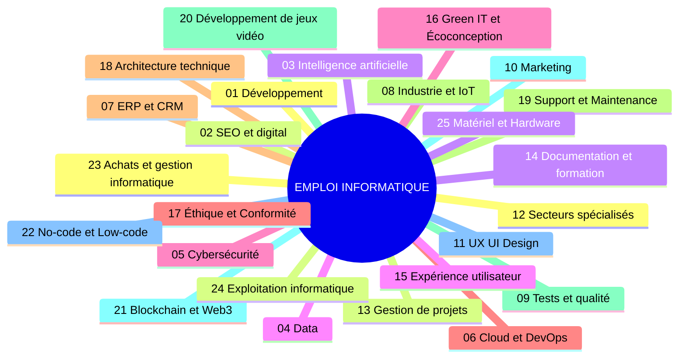

```mermaid
mindmap
  root((EMPLOI INFORMATIQUE))
    01 Développement
    02 SEO et digital
    03 Intelligence artificielle
    04 Data
    05 Cybersécurité
    06 Cloud et DevOps
    07 ERP et CRM
    08 Industrie et IoT
    09 Tests et qualité
    10 Marketing
    11 UX UI Design
    12 Secteurs spécialisés
    13 Gestion de projets
    14 Documentation et formation
    15 Expérience utilisateur
    16 Green IT et Écoconception
    17 Éthique et Conformité
    18 Architecture technique
    19 Support et Maintenance
    20 Développement de jeux vidéo
    21 Blockchain et Web3
    22 No-code et Low-code
    23 Achats et gestion informatique
    24 Exploitation informatique
    25 Matériel et Hardware
```
